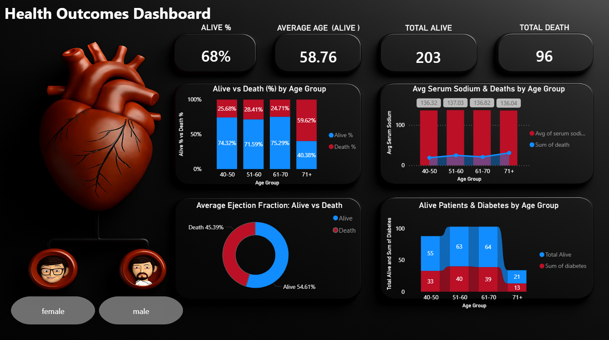

# 🩺 Health Outcomes Dashboard | Power BI

An interactive **Healthcare Analytics dashboard** built using **Power BI** to analyze **patient outcomes (Alive vs Death)** using clinical and demographic data.

This project focuses on uncovering survival patterns across **age groups, gender, diabetes status, serum sodium levels, and ejection fraction**, presented through a clean and insightful dashboard.

---

## 🧠 Business Context
Healthcare organizations rely on data-driven insights to understand patient risk factors and improve outcomes.  
This dashboard helps identify patterns associated with **patient survival and mortality**, supporting better analytical decision-making.

---

## 🎯 Project Objective
- Analyze **Alive and Death outcomes** across different age groups  
- Measure **Death % and Alive %** using key clinical indicators  
- Enable **gender-wise analysis** using interactive slicers  
- Present insights in a clear, visually intuitive Power BI dashboard  

---

## 📊 Dashboard Preview


---

## 📌 Key KPIs
- **Alive %**
- **Death %**
- **Total Alive Patients**
- **Total Death Patients**
- **Average Age (Alive)**

---

## 📈 Dashboard Insights
- **Alive % vs Death % by Age Group**
- **Average Serum Sodium & Deaths by Age Group**
- **Alive Patients and Diabetes by Age Group**
- **Average Ejection Fraction — Alive vs Death**

These visuals help identify how clinical factors vary between alive and deceased patients.

---

## 🔍 Interactivity
- **Male / Female slicer** using gender icons  
- All KPIs and visuals update dynamically based on gender selection  
- Enables quick comparison between male and female patient outcomes  

---

## 🛠 Tools & Skills Used
- **Power BI**
- **DAX**
- **Data Modeling**
- **Data Visualization**
- **Healthcare Analytics**

---

## 📁 Repository Structure
```
health-outcomes-dashboard-powerbi/
│
├── data/
│ └── heart_disease_dataset.xlsx
│
├── images/
│ └── heart_image.png
│
├── README.md
└── LICENSE
```

---

## 📜 License
This project is licensed under the **MIT License**.  
You are free to use, modify, and distribute this project with proper attribution.

---

## ⭐ Key Takeaways
- Built an end-to-end **Power BI healthcare dashboard**
- Converted raw clinical data into meaningful insights
- Applied KPI design and interactive filtering for better analysis

---
